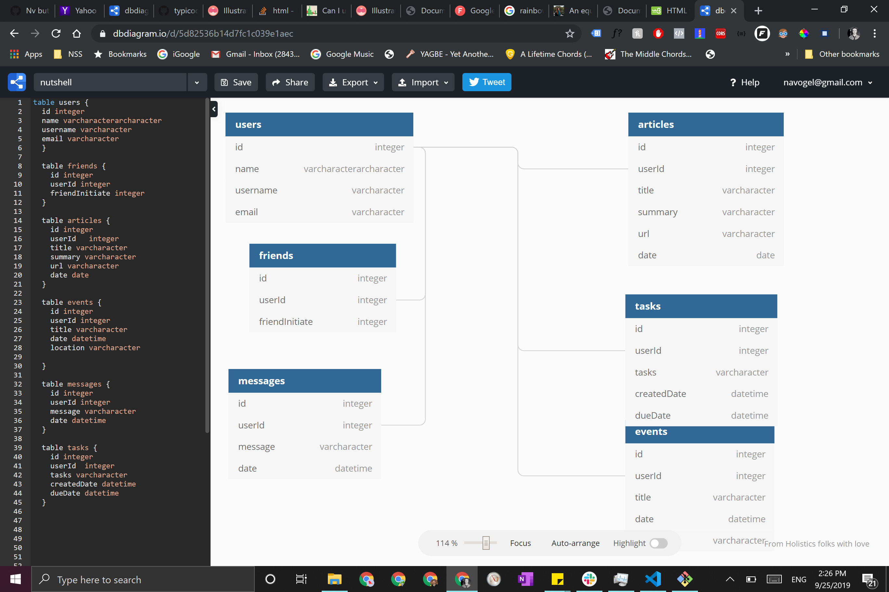

# Nutshell: The LGBT Community Application

## Setup: Follow these steps exactly

1. Clone this repository
1. `cd` into the directory it creates
1. Make a `database.json` file in the `api` directory
1. Run `npm install` and wait for all dependencies to be installed
1. Run `npm start` to verify that installation was successful.

## About

Nutshell is a program built to connect people of LGBTQ groups for shared news, events, tasks, and chatrooms. Once signed in and logged on, the user can connect with friends on the public and share their information with their list of like-minded people.

## Creators

James McClarty, Nate Vogel, Alex Momotyuk

## DBDiagram

